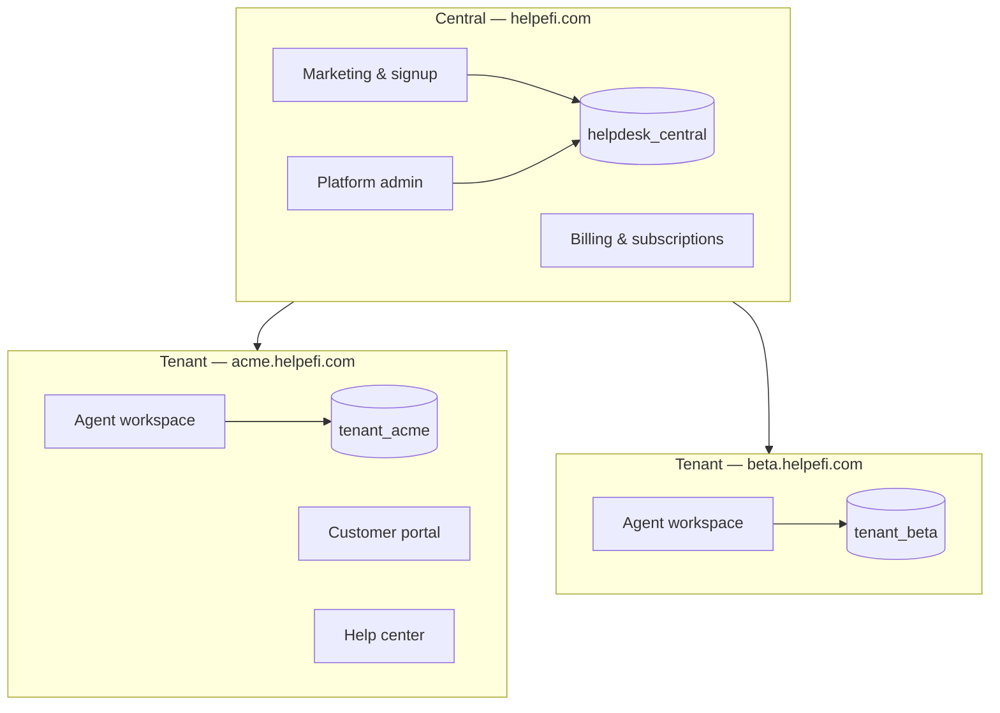

# Helpefi

**Multi-tenant helpdesk and ITSM platform** — tickets, service desk, knowledge base, automation, and customer portal, built for teams that need their own workspace on a shared platform.

Production: [helpefi.com](https://helpefi.com)

---

## Overview

Helpefi is a SaaS product with a **central platform** (marketing, signup, billing, platform admin) and **isolated tenant workspaces** (agent app, customer portal, settings). Each workspace gets its own database, domain, and configuration while sharing the same application codebase.



---

## Stack

| Layer | Technology |
|-------|------------|
| Backend | PHP 8.4, Laravel 13 |
| Multi-tenancy | [stancl/tenancy](https://tenancyforlaravel.com) — database-per-tenant |
| Frontend | Vue 3, Inertia.js 3, Tailwind CSS 4, Vite 8 |
| Architecture | Domain-driven design — **Controller → Service → Repository** |
| Auth & RBAC | Session guards, Spatie permissions, OIDC + SAML SSO |
| Queue & cache | Redis |
| Realtime | Node WebSocket server (`realtime/server.mjs`) |
| Payments | Stripe, Razorpay |
| AI | OpenAI |
| Observability | Laravel Telescope (central DB) |

---

## Capabilities

### Agent workspace
- Ticket inbox, workspace queues, views, merges, and side conversations
- Contacts, organizations, tags, and custom fields
- Knowledge base with categories and portal publishing
- Macros, automations, assignment rules, and SLA policies
- Service desk — problems, changes, approvals, major incidents
- Service catalog, assets, time tracking, and CSAT
- Email channels, templates, and inbound/outbound mail
- Integrations — Slack, CRM enrichment, Shopify, HubSpot, Salesforce
- AI-assisted triage, deflection, and reply suggestions

### Customer-facing
- Branded customer portal and help center
- Self-service ticket submission and conversation history
- Multi-brand support with custom domains

### Platform
- Tenant provisioning, custom domains, and release upgrades
- Subscription billing, trials, and plan enforcement
- Platform admin, executive metrics, and slow-query observability
- Marketing site, blog, and SEO tooling

---

## Local setup

### Valet (recommended on macOS)

```bash
composer install
cp .env.example .env
php artisan key:generate

# Central database (MySQL)
mysql -e "CREATE DATABASE IF NOT EXISTS helpdesk_central CHARACTER SET utf8mb4 COLLATE utf8mb4_unicode_ci;"
php artisan migrate --seed

npm install
npm run build
valet link helpdesk
```

Open **http://helpdesk.test**

**Demo credentials**

| Field | Value |
|-------|-------|
| Email | `admin@helpdesk.test` |
| Password | `password` |

### Docker

```bash
./docker/setup.sh
```

See [docs/ssl-and-deployment.md](docs/ssl-and-deployment.md) for Docker production and SSL.

---

## Development

Start the full local stack (HTTP server, queue worker, realtime, logs, Vite):

```bash
composer dev
```

Or run services individually:

```bash
npm run dev          # Vite HMR
npm run realtime     # WebSocket server
php artisan queue:listen
php artisan serve    # if not using Valet
```

**Tenant commands**

```bash
php artisan tenants:migrate          # Run tenant migrations
php artisan tenants:upgrade            # Apply release upgrade steps
php artisan permissions:sync           # Sync RBAC permissions
```

---

## Testing

```bash
composer test
# or
./vendor/bin/phpunit
```

Feature tests use tenant databases. Run `php artisan permissions:sync` if tests fail with permission seeder errors.

---

## Project structure

```
app/Domains/
  Platform/        Central admin, marketing, billing metadata
  Tenancy/         Tenant provisioning, domains, infrastructure
  Tickets/         Ticket lifecycle, workspace, replies
  Contacts/        Customers, organizations, tags
  Knowledge/       Articles, help center, portal
  Channels/        Email, messaging, templates
  ServiceDesk/     ITSM — problems, changes, incidents
  Automation/      Rules, macros, assignment
  Integrations/    Slack, CRM, commerce connectors
  Ai/              Triage, deflection, assist
  Security/        2FA, audit logs, SSO
  ...

database/migrations/         Central schema
database/migrations/tenant/  Per-tenant schema

resources/js/Pages/        Inertia Vue pages
routes/central/              Platform routes
routes/tenant/               Workspace routes
```

---

## Documentation

| Document | Description |
|----------|-------------|
| [docs/ai-context.md](docs/ai-context.md) | Architecture, auth, sessions, mail, deployment reference |
| [docs/ssl-and-deployment.md](docs/ssl-and-deployment.md) | HTTPS, DNS, Docker, and native deployment |
| [docs/tenant-releases.md](docs/tenant-releases.md) | Tenant upgrade framework and release steps |
| [docs/plan.md](docs/plan.md) | Implementation roadmap |
| [docs/marketing-seo.md](docs/marketing-seo.md) | Marketing site and SEO |

---

## Deployment

Production deploys automatically on push to `main` via GitHub Actions (`.github/workflows/deploy.yml`). The release script on EC2 runs migrations, tenant upgrades, asset builds, and cache optimization.

For manual deployment steps and SSL setup, see [docs/ssl-and-deployment.md](docs/ssl-and-deployment.md).

---

## License

MIT
