# Helpdesk Platform — Implementation Plan (Single-Tenant)

## Current State (June 2026)

**Phases 1–4 are complete.** The product is a full single-tenant helpdesk comparable to Freshdesk Growth / Help Scout Plus for email-centric support.

| Area | Status |
|------|--------|
| Core ticketing | Merge, split, views, filters, CC, requester, custom fields, export |
| Channels | Email (webhook + IMAP/OAuth), web, portal, API |
| Agent UX | Workspace (queue + conversation + sidebar), global search, modern forms |
| SLA & automation | Business hours, breach job, escalations, rule engine |
| KB & portal | Collections, versions, guest/auth submit & track, service catalog |
| CSAT, reports, notifications | Portal surveys, saved reports, CSV, in-app + email alerts |
| AI (agent-side) | Suggest reply, summarize, KB assist |
| CMDB, workforce, security | Assets, depts/teams, 2FA, audit, custom roles |
| Integrations | Outbound webhooks, broad REST API, Postman collection |

**Not yet at parity with:** Zendesk Professional (routing depth, side convos, multi-brand), Intercom (in-app chat, proactive messaging, AI deflection).

---

## Architecture

| Decision | Choice |
|---|---|
| Repo layout | Single Laravel app with `app/Domains/` |
| Frontend | Vue 3 + Inertia.js + Tailwind 4 |
| Backend | Controller → Service → Repository |
| Auth | Session login + Spatie roles + custom roles |
| Database | SQLite (local) / PostgreSQL (production) |
| Local dev | Laravel Valet — `http://helpdesk.test` |

---

## Completed — Phases 1–4

<details>
<summary>Modules 00–17 (click to expand)</summary>

### Module 00 — Foundation
Login, dashboard, MVP CRUD, demo seeder.

### Module 01 — Auth & Team
Invitations, member management, profile/password.

### Module 02 — Contacts & Organizations
Organizations, tags, notes, activity timeline, domain auto-link.

### Module 03 — Ticketing Enhancements
Attachments, watchers, merge/split, saved views, REST API.

### Module 04 — Omnichannel
Channel registry, inbound email webhook, IMAP/POP3 polling, OAuth (Google/Microsoft/Zoho), outbound SMTP, threading.

### Module 05 — Knowledge Portal
Collections, version history, public portal, customer auth, service catalog.

### Module 06 — SLA Engine
Business hours, priority targets, breach job, escalations, timer UI.

### Module 07 — Workflow Automation
Triggers (created/updated/customer message), conditions, actions.

### Module 08 — Agent Workspace
Split-pane queue, polling, composer drafts, quick updates, viewport-locked layout, details sidebar.

### Module 09 — Reports
Dashboard widgets, saved reports, CSV export.

### Module 10 — Integrations
Outbound webhooks with HMAC signatures and delivery log.

### Module 11 — AI Layer
Agent assist: suggest reply, summarize, KB assist.

### Module 12 — ITSM Service Catalog
Ticket types, catalog items, portal requests.

### Module 13 — Assets & CMDB
Asset types, hierarchy, ticket linkage.

### Module 14 — Billing (simulated)
Starter / Professional / Enterprise plans, feature gates.

### Module 15 — Security
TOTP 2FA, audit logs, retention purge.

### Module 16 — Notifications
In-app inbox, email alerts, admin toggles.

### Module 17 — CSAT
Portal surveys, reports, dashboard widget.

</details>

### Recent — Agent UX & Ticketing (Phase 4b)

| Task | Done |
|------|------|
| Top navbar — breadcrumbs, global search (⌘K), New ticket, user menu | ✅ |
| Shared list UI — PageHeader, ListPanel, FilterField, DataTable across pages | ✅ |
| Viewport-locked ticket show — conversation fill, composer dock, embedded sidebar | ✅ |
| Modern create forms — FormPage, FormField, FormRichTextField | ✅ |
| Requester combobox — search or create by email | ✅ |
| Ticket CCs — chip input, outbound CC on replies, merge copy | ✅ |
| Workspace layout fix — compact header, TicketComposerDock, xl sidebar | ✅ |
| Shared ticket views — team visibility on saved views | ✅ |

---

## Phase 5 — Market Parity Roadmap

Competitive analysis vs Zendesk, Freshdesk, Intercom, Help Scout (June 2026).

```mermaid
flowchart LR
    subgraph p5a [5A Agent productivity]
        M1[Macros]
        M2[Realtime]
        M3[Collision]
        M4[Inbound CC]
    end
    subgraph p5b [5B Scale]
        M5[Auto-assign]
        M6[Side convos]
        M7[Email CSAT]
    end
    subgraph p5c [5C Omnichannel]
        M8[Live chat]
        M9[AI deflection]
        M10[Scheduled reports]
    end
    subgraph p5d [5D Enterprise]
        M11[API parity]
        M12[Automation v2]
        M13[Multi-brand]
        M14[Stripe]
        M15[Slack/Jira]
    end
    p5a --> p5b --> p5c --> p5d
```



---

## Phase 5 — Task List

### 5A — Agent Productivity (do first)

High daily impact, relatively contained scope.

| ID | Task | Description | Depends on |
|----|------|-------------|------------|
| `phase5-01-macros` | **Canned responses / macros** | Saved reply library; placeholders (`{{ticket.number}}`, `{{contact.name}}`); search + insert in composer; admin CRUD at `/settings/macros` | — |
| `phase5-02-realtime` | **Real-time updates** | Laravel Reverb or Pusher; broadcast new messages, queue changes, ticket updates; remove 5s polling in workspace | — |
| `phase5-03-collision` | **Collision detection** | Track agents viewing/replying per ticket; show banner in workspace + full view; optional lock | `phase5-02-realtime` |
| `phase5-04-inbound-cc` | **Inbound CC parsing** | Parse CC from inbound email; sync to `ticket_ccs`; thread replies from CC addresses | — |

**Acceptance criteria (5A):**
- Agent inserts macro in &lt;2 clicks from composer
- New customer message appears in workspace without manual refresh
- Two agents on same ticket see each other's presence within 2s
- Inbound email with CC adds recipients; CC reply threads correctly

---

### 5B — Scale (teams 10+ agents)

| ID | Task | Description | Depends on |
|----|------|-------------|------------|
| `phase5-05-auto-assign` | **Auto-assignment** | Rules: round-robin, load-based (open ticket count), optional team scope; admin UI | — |
| `phase5-06-side-conversations` | **Side conversations** | Separate email thread to vendor/partner on a ticket; visible in sidebar; does not merge tickets | — |
| `phase5-07-email-csat` | **Email CSAT** | Send satisfaction survey email on resolve/close; link to portal rating; include in CSAT reports | — |

**Acceptance criteria (5B):**
- Unassigned tickets auto-distribute per configured rule
- Agent can email external party from ticket without exposing full thread
- CSAT response rate measurable separately for email vs portal

---

### 5C — Omnichannel & AI (RFP checkboxes)

| ID | Task | Description | Depends on |
|----|------|-------------|------------|
| `phase5-08-live-chat` | **Live chat widget** | Embeddable JS snippet; visitor → ticket/message; agent replies from workspace; offline → email ticket | `phase5-02-realtime` |
| `phase5-09-ai-deflection` | **Customer AI deflection** | Bot on portal + widget: search KB, answer FAQs, create ticket if unresolved; usage metrics | `phase5-08-live-chat` (optional) |
| `phase5-10-scheduled-reports` | **Scheduled reports** | Cron: email CSV/PDF of saved reports on daily/weekly schedule | — |
| `phase5-13-kb-deflection` | **KB deflection at submit** | Suggest articles before ticket create on portal; track deflection rate | — |

**Acceptance criteria (5C):**
- Chat widget works on external site with one script tag
- ≥30% of portal visitors see KB suggestions before submit (measurable)
- Admin receives weekly SLA breach report by email without login

---

### 5D — Enterprise & Monetization

| ID | Task | Description | Depends on |
|----|------|-------------|------------|
| `phase5-11-api-parity` | **API parity** | REST endpoints for contacts, organizations; ticket PDF/email export via API | — |
| `phase5-12-automation-v2` | **Automation v2** | Delayed actions, multi-step chains, webhook as action, auto-tag/priority from keywords | — |
| `phase5-14-multi-brand` | **Multi-brand** | Brands with own portal URL, mailbox, KB collection, ticket form defaults | — |
| `phase5-15-time-tracking` | **Time tracking** | Log minutes per ticket; agent/team rollup in reports | — |
| `phase5-16-stripe-billing` | **Stripe billing** | Replace simulated plans; subscriptions, invoices, seat limits, usage overages | — |
| `phase5-17-integrations-slack-jira` | **Slack + Jira** | Post ticket events to Slack; create/link Jira issues bidirectionally | — |
| `phase5-18-skills-routing` | **Skills routing** | Agent skills tags; route by skill + priority; group SLA by team/tier | `phase5-05-auto-assign` |

---

## Known Gaps (not scheduled)

Defer unless a specific buyer requires them.

| Gap | Notes |
|-----|-------|
| Voice / telephony | Integrate Twilio later |
| Social channels (X, Facebook) | Low priority vs chat/email |
| Full ITIL change advisory board | Service catalog covers basic ITSM |
| Self-hosted deployment | Cloud-first |
| Native mobile apps | Responsive web sufficient |
| Multi-tenancy / white-label | Single-tenant by design |
| Asset network discovery / RDP | Removed in migration `2026_06_08_920000` |
| Intercom-style proactive messaging | Different product bet; only if SaaS ICP |

---

## API Gaps (web-only today)

Track under `phase5-11-api-parity` — **complete**:

- Contacts CRUD API — done
- Organizations CRUD API — done
- Ticket PDF/email export API — done
- SLA escalation rule CRUD API — done (`GET/POST/DELETE /api/v1/sla/escalations`, `GET /api/v1/sla/escalations/meta`)
- Helpdesk/ticket settings API — done (`GET/PUT /api/v1/settings/helpdesk`)
- Global search API — done (`GET /api/v1/search?q=`)

---

## Conventions

- Domains under `app/Domains/{Name}/`
- Inertia pages under `resources/js/Pages/`
- Controller → Service → Repository; no fat controllers
- Feature tests for auth, critical flows, and each Phase 5 module
- No code comments unless non-obvious business logic

---

## Local Setup

```bash
composer install && npm install
cp .env.example .env && php artisan key:generate
touch database/database.sqlite
php artisan migrate --seed && npm run build
valet link helpdesk
```

Demo login: `admin@helpdesk.test` / `password`

---

## Next Up

**Phase 5B** (in progress):

1. `phase5-05-auto-assign` — round-robin and load-based routing (done)
2. `phase5-06-side-conversations` — email third parties from a ticket (done)
3. `phase5-07-email-csat` — satisfaction survey on resolve/close (done)
4. `phase5-08-live-chat` — embeddable live chat widget with agent inbox integration (done)
5. `phase5-09-ai-deflection` — customer-facing AI deflection on portal and chat (done)
6. `phase5-13-kb-deflection` — semantic KB search and suggested articles before ticket submit (done)

**Phase 5D** (next):

1. `phase5-14-multi-brand` — per-brand portal URL, mailbox, KB collection, ticket form defaults (done)

**Phase 5D** (next):

1. `phase5-15-time-tracking` — log minutes per ticket; agent/team rollup in reports (done)

**Phase 5D** (next):

1. `phase5-16-stripe-billing` — skipped (simulated billing retained)
2. `phase5-17-integrations-slack-jira` — Slack notifications; Jira/Linear issue create/link and status sync (done)

**Phase 5D** (next):

1. `phase5-18-skills-routing` — skills-based routing and group SLA policies by team/customer tier (done)

Phase 5 is complete. API parity follow-up (`phase5-11-api-parity`) is complete.
