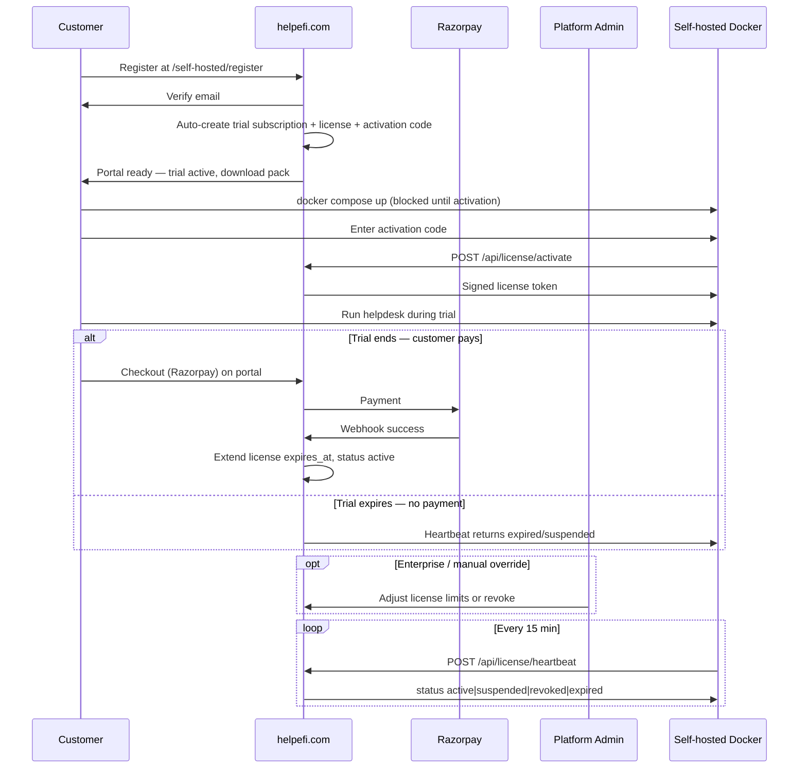

# Self-Hosted Licensing and Distribution — Implementation Plan

## 1. Purpose

This plan defines how helpefi delivers **commercial self-hosted** deployments with:

1. **Central license authority** — all keys are created, renewed, and blocked on **helpefi.com** by platform admins only.
2. **Customer onboarding on central** — self-hosted buyers register on the central domain, receive a subscription + license, then deploy Docker locally.
3. **Unbypassable enforcement** — no localhost, debug, or env-flip exceptions; all app surfaces require a valid, non-revoked license.
4. **Remote block** — platform admin can suspend or revoke a license; installs stop within the heartbeat window.
5. **Mandatory encoded PHP** — every customer self-hosted image uses ionCube-protected `app/` so licensing and enforcement code cannot be tampered with.

**Core principle:** The self-hosted install is a **runtime client** of the central license authority. It does not issue its own keys.

This document supersedes offline-only `helpefi:generate-license` as the primary workflow (CLI remains emergency ops on central only).

---

## 1.1 Design decisions (agreed direction)

| Decision | Choice |
|----------|--------|
| Who creates license keys? | **Platform admins on helpefi.com only** — never tenant workspace admins, never agents |
| Where do customers get a key? | **Central domain** — account + subscription + license portal |
| Can license be bypassed on localhost? | **No** — same enforcement as production |
| How is revoke enforced? | **Signed license + periodic central heartbeat** |
| Who blocks a license? | **Platform admin on central** — suspend / revoke |
| Self-hosted install admin can… | **View status, activate, request renewal** — not create or forge keys |
| Self-hosted customer auth | **Separate guard** (`self_hosted_customer`) — not `PlatformUser`, not tenant users |
| Account approval | **Automatic on registration** — free trial starts immediately; paid conversion via Razorpay on central |
| License issuance (default path) | **Automatic** when trial subscription is created — no manual admin step for self-serve |
| Self-hosted Docker image | **Protected only** for customers — ionCube-encoded `app/`; no readable PHP artifact |
| SaaS vs self-hosted products | **SaaS** Starter / Professional / Enterprise = cloud only; **self-hosted** = separate plan line, always protected image |
| License `distribution` field | Always **`protected`** on customer licenses (trial + paid + enterprise) |

---

## 2. Current state (v1 — gaps)

| Component | Location | Behavior today | Gap |
|-----------|----------|----------------|-----|
| Mode flag | `HELPEFI_DEPLOYMENT_MODE` | `saas` or `self_hosted` | OK |
| License token | `HELPEFI_LICENSE_KEY` | `base64url(payload).base64url(hmac)` | Forgable if HMAC secret extracted |
| HMAC secret | `HELPEFI_LICENSE_HMAC_KEY` | Default `helpefi-self-hosted-license-v1` in repo | **Must not ship shared secret** |
| Payload | `HelpefiLicenseService` | `organization`, `expires_at`, `edition`, `issued_at` | No limits, features, license id, distribution |
| Generation | `helpefi:generate-license` | CLI only | No registry, revoke, batch export |
| Validation | `HelpefiLicenseService::resolveValidationError()` | Signature + expiry + grace | OK foundation |
| Middleware | `EnsureValidHelpefiLicense` | **`/admin` routes only** | Tenant app runs without valid license |
| Boot check | `AppServiceProvider` | Logs invalid license | Does not block |
| Storage | None | Key only in `.env` | No DB, no rotation UI |
| Distribution | `Dockerfile` `app` target | Full PHP in image | Readable; no protected variant |

**Security note:** HMAC with a shared secret embedded in every install is **not acceptable** for commercial licensing. Phase 1 must move to **asymmetric signing**.

---

## 3. Goals

### 3.1 Must have (Phase 1–3)

- **Central license authority** on `deployment.mode=saas` (helpefi.com).
- **Self-hosted customer accounts** — separate from SaaS workspace registration.
- **Platform-admin-only** license CRUD: create, view, renew, suspend, revoke, block.
- Ed25519-signed license tokens; **public key only** in self-hosted images.
- Rich payload: `license_id`, `customer_id`, `install_id`, organization, expiry, limits, features, `distribution`.
- **Install activation** — bind self-hosted deployment to central license via one-time activation code.
- **Periodic heartbeat** to central — check `active | suspended | revoked`; short offline cache only.
- **Unbypassable enforcement** on self-hosted (see section 5.4) — including `127.0.0.1`, `APP_DEBUG=true`, artisan, queue, scheduler.
- Self-hosted Platform Admin: **read-only license status** + activate/re-activate — **no key generation**.
- `max_tenants` enforced in provisioning.
- Remote **block** takes effect within heartbeat interval (default 15 minutes).
- **Mandatory protected Docker image** for all customer self-hosted deploys (ionCube-encoded `app/`).
- Boot gate: self-hosted install **refuses to run** if image is not `HELPEFI_DISTRIBUTION=protected`.

### 3.2 Should have (Phase 3–4)

- Customer self-service portal on central: register → verify email → **auto free trial** → activation code in portal.
- **Automatic license provisioning** on trial start and on successful Razorpay payment (no manual admin for self-serve).
- Subscription record linked to self-hosted customer with `trial` → `active` lifecycle on central Razorpay.
- Expiry banners (30 / 7 / 1 day) on self-hosted install and central portal.
- Domain lock + install fingerprint in license payload.
- Feature flags: `byo`, `ai`, etc.
- Audit log on central for all license actions.

### 3.3 Could have (Phase 5+)

- Air-gapped mode with pre-signed short-TTL license bundles (enterprise exception).
- Per-tenant agent limits.

### 3.4 Non-goals

- Tenant workspace **agents** creating or editing licenses.
- Self-hosted install generating keys locally.
- `HELPEFI_DEPLOYMENT_MODE=saas` flip on customer image to disable licensing.
- Custom PHP encryption loader (use ionCube or image-only delivery).
- Permanent offline operation without eventual central check (except negotiated air-gapped SKU).

### 3.5 Honest security boundary

A determined attacker with **root on the server** and an **unencoded PHP image** can always patch code. This plan maximizes practical enforcement:

| Layer | Stops |
|-------|--------|
| Global middleware + console guards | Casual bypass, `.env` delete, localhost testing without key |
| Asymmetric signatures | Forging keys without central private key |
| Install fingerprint binding | Reusing one key on unlimited machines |
| Central heartbeat + revoke | Stolen keys, non-payment, contract end |
| **Protected image (mandatory)** | Tampering with license middleware, services, boot guards |
| Private registry only | Git clone + self-build without license |

---

## 4. Product positioning

Self-hosted is a **separate product line** from SaaS. Customers never choose between readable and encoded PHP — **all self-hosted artifacts are protected**.

| Offering | Plans | Account home | Runtime artifact |
|----------|-------|--------------|------------------|
| **SaaS** | Starter, Professional, Enterprise | helpefi.com → workspace subdomain | helpefi cloud — **no Docker, no source** |
| **SaaS + BYO** | Enterprise (+ BYO add-ons) | Same | helpefi cloud |
| **Self-hosted** | `self_hosted_*` plans (separate from SaaS tiers) | helpefi.com self-hosted portal | **`helpefi/self-hosted:protected` only** |
| **Dedicated VPC** | Enterprise self-hosted | Same portal | Protected image on customer AWS |

**Not offered:**

- Self-hosted readable PHP for any paid tier.
- SaaS Pro / Professional / Enterprise as a downloadable Docker product.

**Self-hosted plan catalog** (new entries in `config/plans.php` — names TBD):

| Plan slug | Purpose |
|-----------|---------|
| `self_hosted_starter` | Trial + entry paid tier |
| `self_hosted_professional` | Mid tier |
| `self_hosted_enterprise` | Unlimited + BYO + premium support |

All map to `distribution: protected` licenses. Feature limits differ by plan; **encoding does not**.

---

## 5. Architecture

### 5.1 Hub-and-spoke model

```
┌──────────────────────────────────────────────────────────────────┐
│  CENTRAL — helpefi.com (deployment.mode = saas)                    │
│                                                                  │
│  Public:  /self-hosted/register  → customer account              │
│           /self-hosted/portal    → license, subscription, docs   │
│                                                                  │
│  Admin:   /admin/licenses        → create / suspend / revoke     │
│           (platform admins ONLY — permission: licenses.manage)   │
│                                                                  │
│  API:     POST /api/license/activate                             │
│           POST /api/license/heartbeat                             │
│           GET  /api/license/status/{license_id}                   │
│                                                                  │
│  DB:      self_hosted_customers, helpefi_licenses,               │
│           self_hosted_subscriptions, self_hosted_installs        │
│  Crypto:  Ed25519 PRIVATE key (vault — never in self-hosted img) │
└────────────────────────────┬─────────────────────────────────────┘
                             │
          activation + heartbeat (HTTPS, mTLS optional)
                             │
                             ▼
┌──────────────────────────────────────────────────────────────────┐
│  CUSTOMER INSTALL — self_hosted Docker                           │
│                                                                  │
│  Boot:    verify signature + local cache + heartbeat status      │
│  Admin:   /admin/license  → view only + paste activation code    │
│  Enforce: ALL routes, artisan, queue, scheduler                  │
│  Crypto:  Ed25519 PUBLIC key baked in image                     │
│  NO:      license generation, signing keys, saas mode flip       │
└──────────────────────────────────────────────────────────────────┘
```

### 5.2 End-to-end customer journey



**Step-by-step:**

| Step | Actor | Action |
|------|-------|--------|
| 1 | Customer | Registers at `https://helpefi.com/self-hosted/register` (company, contact, email, password) |
| 2 | Customer | Verifies email |
| 3 | Central | **Automatically** creates trial subscription + license + activation code (no admin approval) |
| 4 | Customer | Logs into self-hosted portal (`self_hosted_customer` guard) — trial countdown, activation code, downloads |
| 5 | Customer | Deploys `docker-compose.self-hosted.yml` on their server |
| 6 | Customer | Setup wizard → activation code → install calls central activate API |
| 7 | Customer | Runs helpdesk during free trial |
| 8 | Customer | Pays via Razorpay on central portal before trial ends → license extended, subscription `active` |
| 9 | Central | If trial expires unpaid → license `expired` → heartbeat blocks install |
| 10 | Platform admin | Optional override: custom enterprise license, suspend, or revoke |

**Important:** Self-hosted registration does **not** provision a SaaS tenant on helpefi.com. It creates a `self_hosted_customer` record only.

### 5.2.1 Free trial and auto-provisioning (agreed)

| Event | Central automation |
|-------|-------------------|
| Email verified | `SelfHostedOnboardingService::provisionTrial()` runs |
| Trial subscription | `status=trial`, `trial_ends_at=now()+SELF_HOSTED_TRIAL_DAYS` (default 14, reuse `BILLING_TRIAL_DAYS`) |
| Trial license | `status=active`, `distribution=protected`, `expires_at=trial_ends_at`, limits from `SELF_HOSTED_TRIAL_PLAN` |
| Activation code | Generated immediately; shown in portal |
| Razorpay payment success | `SelfHostedBillingService::activatePaid()` — extend `expires_at`, subscription → `active` |
| Trial expired, no payment | License → `expired`; heartbeat blocks install |
| Payment cancelled | Grace via `BILLING_CANCELLATION_GRACE_DAYS`, then suspend |

**Config (central / helpefi.com):**

```env
SELF_HOSTED_TRIAL_ENABLED=true
SELF_HOSTED_TRIAL_PLAN=self_hosted_starter
SELF_HOSTED_TRIAL_DAYS=14
RAZORPAY_PLAN_SELF_HOSTED_STARTER=plan_xxx
RAZORPAY_PLAN_SELF_HOSTED_STARTER_YEARLY=plan_xxx
```

**Self-serve path:** zero manual steps between email verify and activation code.

**Enterprise path:** platform admin creates customer + license manually in `/admin/licenses` (custom limits, offline contract). Still **`distribution: protected`** — same image as self-serve. Skips Razorpay.

### 5.2.2 Self-hosted customer authentication (agreed — separate guard)

Self-hosted buyers are **not** `PlatformUser` (helpefi staff) and **not** SaaS tenant users.

| Piece | Value |
|-------|--------|
| Model | `App\Models\SelfHostedCustomer` |
| Guard | `self_hosted_customer` |
| Table | `self_hosted_customers` |
| Session cookie | `helpefi_sh_customer_session` (distinct from platform + tenant) |
| Login | `POST /self-hosted/login` |
| Portal | `GET /self-hosted/portal` with `auth:self_hosted_customer` |

**Must not share:**

| Guard | Used for |
|-------|----------|
| `platform` | helpefi internal staff (`/admin`) |
| `web` (tenant) | Workspace agents on SaaS or self-hosted install |
| SaaS `/register` | Creates `Tenant` + subdomain — **different product** |

```php
// config/auth.php — registered only when deployment.mode=saas
'self_hosted_customer' => [
    'driver' => 'session',
    'provider' => 'self_hosted_customers',
],
```

Services: `SelfHostedCustomerAuthService`, `SelfHostedCustomerRegistrationService`.

### 5.3 Role separation (who can do what)

| Action | Platform admin (central) | Self-hosted platform admin | Tenant agent / workspace admin |
|--------|--------------------------|------------------------------|--------------------------------|
| Create license (automatic) | Central system on trial start / payment | ❌ | ❌ |
| Create license (manual) | ✅ enterprise only | ❌ | ❌ |
| Renew / extend license | ✅ | ❌ | ❌ |
| Suspend / block / revoke | ✅ | ❌ | ❌ |
| View license details (central) | ✅ | ❌ | ❌ |
| View license status (install) | ✅ (via central) | ✅ read-only | ❌ |
| Activate install (first time) | ❌ | ✅ (activation code) | ❌ |
| Paste replacement key on renewal | ❌ | ✅ (issued by central) | ❌ |
| Manage workspaces / tickets | ❌ (on central) | ✅ | ✅ (within tenant) |

Permissions:

- Central: `licenses.view`, `licenses.manage` — **platform guard only**, not tenant users.
- Self-hosted install: `license.view` — platform admin role on **customer install** only.

### 5.4 Unbypassable enforcement (no localhost exception)

When `HELPEFI_DEPLOYMENT_MODE=self_hosted`, the following rules apply **without exception**:

#### HTTP / Inertia / API

| Rule | Implementation |
|------|----------------|
| Middleware on **every** web request | Prepend `EnsureValidHelpefiLicense` in `bootstrap/app.php` when self_hosted |
| No localhost bypass | Do not skip for `127.0.0.1`, `::1`, or `APP_ENV=local` |
| No debug bypass | `APP_DEBUG=true` does **not** disable license checks |
| No route exceptions except activation | Only `/license/activate`, `/up`, static setup assets |
| Tenant subdomains | Same middleware — workspace agents cannot use app without valid license |
| API tokens | All `/api/*` return `503` with `{ "error": "license_invalid" }` |

#### Console / workers

| Process | Behavior when license invalid |
|---------|-------------------------------|
| `queue:work` | Exit code 1 at boot; no job processing |
| `schedule:run` | Skip all jobs except `license:heartbeat` |
| `artisan *` (general) | Block with message; whitelist: `license:activate`, `license:status`, `migrate` (recovery) |
| `php-fpm` / HTTP | Middleware blocks |

#### Configuration tampering

| Attack | Mitigation |
|--------|------------|
| Set `HELPEFI_DEPLOYMENT_MODE=saas` | Self-hosted images ship with `deployment.mode` hardcoded via build arg; env override ignored in production image |
| Remove `HELPEFI_LICENSE_KEY` from `.env` | License also stored encrypted in DB after activation; empty = blocked |
| Patch middleware | Protected build SKU; integrity check on boot (checksum of middleware file) |
| Replay old heartbeat | Heartbeat response includes `checked_at` + signed nonce; stale cache max 24h |

#### Heartbeat and offline cache

```env
HELPEFI_LICENSE_AUTHORITY_URL=https://helpefi.com
HELPEFI_LICENSE_HEARTBEAT_MINUTES=15
HELPEFI_LICENSE_OFFLINE_MAX_HOURS=24
```

| Central status | Install behavior |
|----------------|------------------|
| `active` | Full operation |
| `suspended` | Block immediately on heartbeat; show "license suspended — contact support" |
| `revoked` | Block immediately; clear cached license |
| `expired` | Grace period from payload, then block |
| Central unreachable | Continue on last **good** heartbeat up to `OFFLINE_MAX_HOURS`, then block |

Scheduled job: `license:heartbeat` every 15 minutes on self-hosted installs.

### 5.5 License token format (v2)

**Structure:** `{payload_b64url}.{signature_b64url}`

**Payload (JSON):**

```json
{
  "v": 2,
  "lic": "550e8400-e29b-41d4-a716-446655440000",
  "cust": "customer-uuid",
  "inst": "install-uuid",
  "org": "Acme Corporation",
  "exp": "2027-12-31",
  "edition": "self_hosted",
  "iat": "2026-06-18T10:00:00Z",
  "distribution": "protected",
  "domain_lock": "helpdesk.acme.com",
  "fingerprint": "sha256-of-install-identity",
  "limits": {
    "max_tenants": 10,
    "max_agents": null
  },
  "features": ["byo", "ai", "automation"]
}
```

| Field | Required | Description |
|-------|----------|-------------|
| `v` | yes | Schema version (`2`) |
| `lic` | yes | License UUID (central registry PK) |
| `cust` | yes | Self-hosted customer UUID on central |
| `inst` | yes | Install UUID — set at activation |
| `org` | yes | Licensed organization name |
| `exp` | yes | Expiry date (end of day UTC) |
| `edition` | yes | `self_hosted` |
| `iat` | yes | Issued at ISO8601 |
| `distribution` | yes | Always **`protected`** for customer licenses |
| `domain_lock` | no | Must match `CENTRAL_APP_DOMAIN` when set |
| `fingerprint` | yes | SHA-256 of install identity (see 5.6) |
| `limits.max_tenants` | no | `null` = unlimited |
| `features` | no | Allow list; empty = all core features |

### 5.6 Install fingerprint

Computed on first boot from stable machine attributes:

```
fingerprint = sha256(
  HELPEFI_INSTALL_SALT (generated on first boot, stored in DB) +
  CENTRAL_APP_DOMAIN +
  app.key fingerprint (first 16 chars)
)
```

Sent to central at activation. License payload includes `fingerprint`. Mismatch on verify → reject (prevents key cloning across servers).

Optional enterprise: allow N installs per license via `max_installs` on central.

### 5.7 Legacy v1 (HMAC) migration

| Step | Action |
|------|--------|
| 1 | Ship v2 verifier alongside v1 HMAC verifier |
| 2 | Detect token version by payload decode (`v` field or absence) |
| 3 | Log deprecation warning for v1 tokens |
| 4 | Remove v1 after 90 days or next major release |

---

## 6. Configuration

### 6.1 Central (helpefi.com — license authority)

```env
HELPEFI_DEPLOYMENT_MODE=saas
HELPEFI_LICENSE_PRIVATE_KEY=        # Ed25519 — vault only
HELPEFI_LICENSE_SIGNING_ENABLED=true
```

### 6.2 Customer self-hosted install

```php
// config/deployment.php
return [
    'mode' => env('HELPEFI_DEPLOYMENT_MODE', 'saas'), // locked to self_hosted in image

    'license_authority_url' => env('HELPEFI_LICENSE_AUTHORITY_URL', 'https://helpefi.com'),
    'license_public_key' => env('HELPEFI_LICENSE_PUBLIC_KEY'),
    'license_heartbeat_minutes' => (int) env('HELPEFI_LICENSE_HEARTBEAT_MINUTES', 15),
    'license_offline_max_hours' => (int) env('HELPEFI_LICENSE_OFFLINE_MAX_HOURS', 24),
    'license_grace_hours' => (int) env('HELPEFI_LICENSE_GRACE_HOURS', 72),

    'distribution' => env('HELPEFI_DISTRIBUTION', 'protected'), // locked at build for customer images
];
```

```env
HELPEFI_DEPLOYMENT_MODE=self_hosted
HELPEFI_LICENSE_AUTHORITY_URL=https://helpefi.com
HELPEFI_LICENSE_PUBLIC_KEY=
HELPEFI_LICENSE_HEARTBEAT_MINUTES=15
HELPEFI_LICENSE_OFFLINE_MAX_HOURS=24
HELPEFI_LICENSE_GRACE_HOURS=72
HELPEFI_DISTRIBUTION=protected
```

Customer registry pull secret grants **`:protected` tag only**. The `:standard` / `app` target is **internal dev and CI** — never published to customer registry.

**Note:** `HELPEFI_LICENSE_KEY` is **not** set manually in production flow — it is obtained via activation API and stored encrypted in DB. Env var supported only for disaster recovery by central ops.

### 6.3 Removed from self-hosted customer hands

- `HELPEFI_LICENSE_PRIVATE_KEY` — never shipped
- `HELPEFI_LICENSE_HMAC_KEY` — removed after v1 sunset
- `helpefi:generate-license` command — **not registered** when `deployment.mode=self_hosted`

---

## 7. Data model

All tables below use `central` connection. License authority tables exist **only when `deployment.mode=saas`** (migrations guarded).

### 7.1 `self_hosted_customers` (central — customer account)

| Column | Type | Notes |
|--------|------|-------|
| `id` | uuid | PK |
| `company_name` | string | |
| `contact_name` | string | |
| `email` | string unique | Login for self-hosted portal |
| `password` | string | Hashed; portal auth |
| `email_verified_at` | datetime nullable | Trial + license provisioned when set |
| `status` | enum | `pending`, `active`, `suspended` |
| `notes` | text nullable | Internal ops notes |
| `created_at` / `updated_at` | | |

**Not** a `Tenant` record. **Not** a `PlatformUser`. Separate guard: `self_hosted_customer`.

### 7.2 `self_hosted_subscriptions` (central)

| Column | Type | Notes |
|--------|------|-------|
| `id` | uuid | PK |
| `self_hosted_customer_id` | FK | |
| `plan` | string | e.g. `enterprise_self_hosted` |
| `billing_interval` | string | `month`, `year`, `contract` |
| `status` | enum | `trial`, `active`, `cancelled`, `expired` |
| `trial_ends_at` | datetime nullable | Set on auto-provision |
| `starts_at` | datetime | |
| `ends_at` | datetime nullable | Paid period end |
| `provisioned_by` | enum | `auto_trial`, `razorpay`, `manual` |
| `custom_amount` | int nullable | |
| `razorpay_subscription_id` | string nullable | If paid via central Razorpay |
| `limits` | json | Denormalized from plan |
| `features` | json | |

### 7.3 `helpefi_licenses` (central — authority registry)

| Column | Type | Notes |
|--------|------|-------|
| `id` | uuid | PK = payload `lic` |
| `self_hosted_customer_id` | FK | |
| `self_hosted_subscription_id` | FK nullable | |
| `status` | enum | `draft`, `active`, `suspended`, `revoked`, `expired` |
| `organization` | string | |
| `expires_at` | date | |
| `distribution` | string | Always `protected` for issued customer licenses |
| `domain_lock` | string nullable | |
| `limits` | json | |
| `features` | json | |
| `activation_code` | string unique | One-time, hashed; shown in portal |
| `activation_code_expires_at` | datetime | |
| `license_key_encrypted` | text nullable | Full signed token after first activation |
| `max_installs` | int default 1 | |
| `issued_at` | datetime | |
| `revoked_at` | datetime nullable | |
| `revoked_reason` | string nullable | |
| `created_by_platform_user_id` | FK nullable | Null when `provisioned_by=auto_trial` or `razorpay` |
| `suspended_by_platform_user_id` | FK nullable | |
| `notes` | text nullable | |

### 7.4 `self_hosted_installs` (central — registered deployments)

| Column | Type | Notes |
|--------|------|-------|
| `id` | uuid | PK = payload `inst` |
| `helpefi_license_id` | FK | |
| `fingerprint` | string | SHA-256 |
| `domain` | string | Customer `CENTRAL_APP_DOMAIN` |
| `app_version` | string nullable | |
| `status` | enum | `active`, `blocked` |
| `activated_at` | datetime | |
| `last_heartbeat_at` | datetime nullable | |
| `last_heartbeat_ip` | string nullable | |
| `blocked_at` | datetime nullable | |
| `blocked_reason` | string nullable | |

### 7.5 `platform_license_settings` (customer install — local cache)

On the **self-hosted** instance only:

| Column | Type | Notes |
|--------|------|-------|
| `license_key_encrypted` | text | Signed token from central |
| `license_id` | uuid | |
| `install_id` | uuid | |
| `central_status` | string | Last heartbeat: `active`, `suspended`, `revoked` |
| `last_heartbeat_at` | datetime | |
| `last_heartbeat_ok_at` | datetime | Last successful `active` response |
| `expires_at` | datetime | |
| `validation_error` | string nullable | |

---

## 8. Application layers

Follow **Controller → Service → Repository**.

### 8.1 Central (helpefi.com) — license authority

| Layer | Class | Responsibility |
|-------|-------|----------------|
| Controller | `SelfHostedAuthController` | Login, logout, password reset |
| Controller | `SelfHostedRegisterController` | Register + verify email |
| Controller | `SelfHostedPortalController` | Dashboard, license, downloads |
| Controller | `SelfHostedBillingController` | Razorpay checkout + webhook handler |
| Service | `SelfHostedOnboardingService` | `provisionTrial()` on email verify |
| Service | `SelfHostedBillingService` | `activatePaid()` on Razorpay webhook |
| Service | `SelfHostedCustomerRegistrationService` | Account + verification email |
| Service | `SelfHostedCustomerAuthService` | Session guard helpers |
| Controller | `AdminLicenseController` | Platform admin CRUD + suspend/revoke |
| Controller | `LicenseAuthorityApiController` | `activate`, `heartbeat`, `status` |
| Service | `HelpefiLicenseSigningService` | Sign tokens (private key) |
| Service | `HelpefiLicenseRegistryService` | Create, renew, suspend, revoke |
| Service | `SelfHostedCustomerService` | Account lifecycle |
| Service | `SelfHostedSubscriptionService` | Plan assignment on central |
| Service | `SelfHostedActivationService` | Activation code → install binding |
| Service | `SelfHostedHeartbeatService` | Process heartbeat, return status |
| Repository | `HelpefiLicenseRepository` | |
| Repository | `SelfHostedCustomerRepository` | |
| Repository | `SelfHostedInstallRepository` | |
| Command | `GenerateHelpefiLicenseCommand` | **Central only** — emergency / scripted issue |
| Middleware | `EnsurePlatformLicensePermission` | `licenses.manage` for admin actions |

### 8.2 Customer install (self_hosted) — runtime client

| Layer | Class | Responsibility |
|-------|-------|----------------|
| Service | `HelpefiLicenseService` | Verify signature, fingerprint, expiry, heartbeat cache |
| Service | `HelpefiLicenseActivationClient` | Call central activate API |
| Service | `HelpefiLicenseHeartbeatClient` | Call central heartbeat API |
| Service | `HelpefiLicenseLimitService` | `max_tenants`, features |
| Service | `InstallFingerprintService` | Generate / persist fingerprint |
| Controller | `AdminLicenseStatusController` | Read-only status + activation form |
| Repository | `PlatformLicenseSettingsRepository` | Local encrypted cache |
| Middleware | `EnsureValidHelpefiLicense` | Block all surfaces |
| Middleware | `EnsureLicenseDistribution` | Protected build gate |
| Command | `LicenseActivateCommand` | `license:activate {code}` |
| Command | `LicenseHeartbeatCommand` | `license:heartbeat` (scheduled) |
| Command | — | **`helpefi:generate-license` NOT registered** |

### 8.3 Central License Authority API

Base URL: `https://helpefi.com/api/license`

#### `POST /activate`

Request:

```json
{
  "activation_code": "XXXX-XXXX-XXXX",
  "fingerprint": "sha256...",
  "domain": "helpdesk.acme.com",
  "app_version": "1.2.0"
}
```

Response `200`:

```json
{
  "license_key": "payload.signature",
  "license_id": "uuid",
  "install_id": "uuid",
  "status": "active",
  "expires_at": "2027-12-31"
}
```

Errors: `404` invalid code, `409` max installs exceeded, `403` customer suspended.

#### `POST /heartbeat`

Request:

```json
{
  "license_id": "uuid",
  "install_id": "uuid",
  "fingerprint": "sha256...",
  "domain": "helpdesk.acme.com"
}
```

Response:

```json
{
  "status": "active",
  "checked_at": "2026-06-18T12:00:00Z",
  "expires_at": "2027-12-31",
  "nonce": "signed-token"
}
```

Status values: `active`, `suspended`, `revoked`, `expired`.

#### `GET /status/{license_id}` (platform admin API token)

For central admin dashboard and support tooling.

### 8.2 `HelpefiLicenseService` public API

```php
public function isRequired(): bool;
public function validate(): bool;
public function resolveValidationError(): ?string;
public function decoded(): ?array;
public function licenseId(): ?string;
public function expiresAt(): ?CarbonInterface;
public function daysUntilExpiry(): ?int;
public function isInGracePeriod(): bool;
public function distribution(): string;
public function maxTenants(): ?int;
public function hasFeature(string $feature): bool;
public function assertCanCreateTenant(int $currentTenantCount): void;
```

### 8.4 Enforcement matrix (revised)

| Surface | Invalid / suspended / revoked | Allowed exceptions |
|---------|------------------------------|-------------------|
| All web (central + tenant) | 503 license page | `/license/activate`, `/up` |
| `/api/*` | 503 JSON | `/api/license/activate` only on first setup |
| `queue:work` | Exit 1 at boot | — |
| `schedule:run` | Only `license:heartbeat` | — |
| `artisan` | Block | `license:*`, `migrate` |
| Localhost | **Same as production** | — |
| `APP_DEBUG=true` | **No bypass** | — |

**Health `/up`:** HTTP 200 but body includes `"license_ok": false` when invalid (LB stays healthy; monitoring alerts).

---

## 9. Central UI — Platform admin licenses (`deployment.mode=saas`)

**Routes:** `/admin/licenses`, `/admin/licenses/{id}`  
**Permission:** `licenses.view` (list), `licenses.manage` (create/edit/block)  
**Guard:** `platform` — **never** available to tenant agents or self-hosted customer portal users.

### 9.1 License list

- Filter: status, expiry window, customer email, distribution
- Columns: organization, customer, status, expires, installs, last heartbeat
- Actions: View, Suspend, Revoke, Renew

### 9.2 Create license (platform admin only)

Form fields:

- Self-hosted customer (select or create inline)
- Subscription (link or create)
- Organization name
- Expiry date
- Limits: max tenants, max installs
- Features checkboxes
- Domain lock (optional)
- `distribution` fixed to **`protected`** (read-only in UI — not customer-selectable)
- Generate activation code (auto)

**Output:** Activation code shown once + email to customer portal.

### 9.3 Block / suspend / revoke

| Action | Effect on central | Effect on install |
|--------|-------------------|-------------------|
| **Suspend** | `status=suspended` | Block on next heartbeat (≤15 min) |
| **Revoke** | `status=revoked`, invalidate activation code | Block on next heartbeat; cannot re-activate same code |
| **Renew** | New `expires_at`, new activation code or re-sign token | Customer enters new code or auto-refresh via heartbeat |

Audit log entry for every action: who, when, reason.

### 9.4 Vue pages

- `resources/js/Pages/Central/Admin/Licenses/Index.vue`
- `resources/js/Pages/Central/Admin/Licenses/Show.vue`
- `resources/js/Pages/Central/Admin/Licenses/Form.vue`

---

## 10. Central UI — Self-hosted customer portal

**Guard:** `self_hosted_customer` — **separate auth** (agreed). Not `platform`, not tenant `web`.

| Route | Middleware | Purpose |
|-------|------------|---------|
| `GET /self-hosted/register` | `guest:self_hosted_customer` | Create account |
| `GET /self-hosted/login` | `guest:self_hosted_customer` | Login |
| `POST /self-hosted/login` | `guest:self_hosted_customer` | Authenticate |
| `GET /self-hosted/verify/{token}` | guest | Email verification → triggers `provisionTrial()` |
| `GET /self-hosted/portal` | `auth:self_hosted_customer` | Dashboard |
| `GET /self-hosted/portal/license` | `auth:self_hosted_customer` | Activation code, trial/paid status |
| `GET /self-hosted/portal/subscription` | `auth:self_hosted_customer` | Plan, upgrade, Razorpay checkout |
| `GET /self-hosted/portal/downloads` | `auth:self_hosted_customer` | Compose, env template, image pull |

### 10.1 Portal dashboard (after email verify)

- **Trial banner:** “X days left — add payment to continue”
- **Activation code** (copy button) — available immediately after trial provision
- License status synced from central
- Download deployment pack (**protected image** pull instructions only)
- **Upgrade** → Razorpay checkout (monthly/yearly self-hosted plans)

### 10.2 Trial → paid transition

1. Customer clicks **Upgrade** in portal.
2. Razorpay subscription created on central (not on self-hosted install).
3. Webhook `subscription.activated` / `payment.captured` → `SelfHostedBillingService::activatePaid()`.
4. License `expires_at` extended to paid period; `helpefi_licenses.status` stays `active`.
5. Existing install receives updated expiry on next heartbeat (no re-activation unless revoked).

Customer **cannot** create or forge licenses — only view and activate what central issued automatically or via enterprise admin.

### 10.3 Vue pages

- `resources/js/Pages/Central/SelfHosted/Register.vue`
- `resources/js/Pages/Central/SelfHosted/Login.vue`
- `resources/js/Pages/Central/SelfHosted/Portal/Dashboard.vue`
- `resources/js/Pages/Central/SelfHosted/Portal/License.vue`
- `resources/js/Pages/Central/SelfHosted/Portal/Subscription.vue`

---

## 11. Self-hosted install UI — License (read-only + activate)

**Route:** `GET /admin/license`  
**Permission:** `license.view` (platform admin on install)  
**When:** `deployment.mode === self_hosted`

### 11.1 Before activation

- Full-screen setup wizard — app blocked
- Field: activation code (from central portal)
- Button: Activate → calls central API
- No skip, no demo mode

### 11.2 After activation

- **Read-only** status card: Valid / Suspended / Revoked / Grace / Offline cache
- Organization, license ID, install ID, expiry, limits, features
- Last heartbeat time
- Link to central portal for renewal
- **No** "generate license" button
- **No** key editing (except disaster "replace activation code" on renewal)

### 11.3 Vue page

`resources/js/Pages/Central/Admin/License/Status.vue`

## 12. CLI specification (central ops only)

Commands registered **only when `deployment.mode=saas`**:

### 12.1 `helpefi:licenses:create`

```bash
php artisan helpefi:licenses:create \
  --customer=customer@acme.com \
  --organization="Acme Corp" \
  --expires=2027-12-31 \
  --max-tenants=10 \
  --json
```

`--distribution` flag removed from customer-facing flows; all licenses default to `protected`.

### 12.2 `helpefi:licenses:suspend {license-id} --reason="..."`

### 12.3 `helpefi:licenses:revoke {license-id} --reason="..."`

### 12.4 `helpefi:licenses:export-handoff {license-id}`

Self-hosted install commands:

```bash
php artisan license:activate XXXX-XXXX-XXXX
php artisan license:status
php artisan license:heartbeat
```

---

## 13. Protected distribution (mandatory for all customer self-hosted)

Every customer self-hosted deployment — **trial, paid, and enterprise** — runs the **ionCube-protected** Docker image. There is no customer-facing readable PHP artifact.

Encoding exists specifically so customers **cannot modify** license verification, middleware, heartbeat clients, boot guards, or related enforcement code.

### 13.1 Policy summary

| Audience | Image | PHP in `app/` |
|----------|-------|----------------|
| Customer trial | `helpefi/self-hosted:protected` | ionCube encoded |
| Customer paid | `helpefi/self-hosted:protected` | ionCube encoded |
| Customer enterprise | `helpefi/self-hosted:protected` | ionCube encoded |
| helpefi internal dev | `app` / `:standard` (local compose) | Readable — **not shipped to customers** |
| helpefi CI | Both targets — tests on standard, release on protected | |

**SaaS plans** (Starter, Professional, Enterprise) remain **cloud-only**. Self-hosted is a separate product line with `self_hosted_*` plan slugs.

### 13.2 Encoder: ionCube

**Primary:** ionCube Encoder + ionCube Loader for **PHP 8.4** (match `Dockerfile` base image).

**Fallback (spike only):** SourceGuardian — use only if ionCube blocks Laravel 13 / PHP 8.4 workflows.

**Roles:**

| System | Purpose |
|--------|---------|
| **helpefi central license** | Business license, trial, payment, revoke, limits |
| **ionCube** | Prevent reading/editing PHP enforcement implementation |

Do **not** use ionCube’s license server as the primary billing/license authority.

### 13.3 Encode scope

Encode the **entire `app/` directory** in the protected image. Partial encoding leaves bypass paths (replace one readable file, stub a class).

| Path | Customer protected image |
|------|--------------------------|
| `app/` | **Encoded** (all Domains, Http, Console, Providers, Models) |
| `bootstrap/app.php` | **Encoded** or copied from encoded build output |
| `routes/` | Readable (thin route files; logic lives in encoded `app/`) |
| `config/` | Readable (env-driven; no secrets) |
| `vendor/` | Readable (Composer dependencies) |
| `resources/` | Readable (Blade); JS already Vite-bundled in `public/build` |
| `database/migrations/` | Readable (schema only) |

**License-critical paths** (included inside encoded `app/`):

- `app/Domains/Platform/Services/HelpefiLicense*.php`
- `app/Http/Middleware/EnsureValidHelpefiLicense.php`
- `app/Http/Middleware/EnsureLicenseDistribution.php`
- `app/Providers/AppServiceProvider.php` (boot guards)
- `app/Console/Commands/License*.php`
- Activation / heartbeat client services

### 13.4 Dockerfile and CI pipeline

**Stages:**

```dockerfile
# syntax=docker/dockerfile:1

FROM app AS encoder-input
# Full readable app from existing `app` target

FROM ioncube/encoder:13-php8.4 AS encoder
COPY --from=encoder-input /var/www/html/app /source/app
COPY --from=encoder-input /var/www/html/bootstrap/app.php /source/bootstrap/app.php
RUN ioncube_encoder.sh /source/app -o /encoded/app \
    && ioncube_encoder.sh /source/bootstrap/app.php -o /encoded/bootstrap/app.php

FROM app AS app-protected
RUN install-ioncube-loader-php8.4
COPY --from=encoder /encoded/app /var/www/html/app
COPY --from=encoder /encoded/bootstrap/app.php /var/www/html/bootstrap/app.php
ENV HELPEFI_DISTRIBUTION=protected
ENV HELPEFI_DEPLOYMENT_MODE=self_hosted
```

**CI (release):**

```yaml
jobs:
  build-self-hosted:
    steps:
      - docker build --target app -t helpefi/app:ci .
      - docker build --target app-protected -t helpefi/self-hosted:${VERSION}-protected .
      - docker push helpefi/self-hosted:${VERSION}-protected
      # Do NOT push readable app target to customer registry
```

**`docker-compose.self-hosted.yml`:** default `app` service build target = **`app-protected`** for customer docs; internal dev compose may override to `app` locally.

### 13.5 Registry and delivery

| Registry scope | Tags |
|----------------|------|
| **Customer private registry** | `helpefi/self-hosted:*-protected` only |
| **Internal registry** | `app`, `app-protected` for dev/CI |

Portal **downloads** page provides:

- Registry URL + pull secret (scoped to protected repo)
- `docker-compose.self-hosted.yml` (points at protected image)
- `.env.self-hosted.example`
- Activation instructions

**No git access.** No readable image pull for customers.

### 13.6 Runtime gates

**`EnsureLicenseDistribution` middleware** (self-hosted only):

| `HELPEFI_DISTRIBUTION` (image) | License payload `distribution` | Result |
|--------------------------------|--------------------------------|--------|
| `protected` | `protected` | OK |
| `protected` | missing / wrong | **503** — license artifact mismatch |
| `standard` | any | **503** — customer image must not be standard |
| not `protected` | any | **503** at boot |

**`HelpefiLicenseService`:** reject tokens where `distribution !== 'protected'` on self-hosted installs.

**Provision trial / paid license on central:** always set `distribution: 'protected'`.

### 13.7 Loader and platform requirements

Customer server / container must run:

- PHP **8.4** with **ionCube Loader** extension enabled (installed in `app-protected` image)
- Same arch as build (linux/amd64 default; arm64 if you ship multi-arch)

Document in `self-hosted-deployment.md`:

- Loader is bundled in the image — customer does not install separately when using official image
- Custom Kubernetes/ECS builds must use `app-protected` base, not `php:8.4-fpm` + manual copy

### 13.8 Upgrade and support runbook

| Event | Action |
|-------|--------|
| PHP minor bump (8.4 → 8.5) | Re-encode with matching encoder + loader; release new protected tag |
| Security patch release | CI rebuild protected image; customers `docker pull` + rolling restart |
| Debug customer issue | Use central portal (license status, heartbeat, install_id) — not step-through of customer PHP |
| Reproduce locally | helpefi dev uses **readable** `app` target; never customer’s encoded image for debugging logic |

### 13.9 What protected build does NOT do

- Does not hide JavaScript (Vite bundle in `public/build`).
- Does not prevent skilled root-level runtime attacks.
- Does not replace central license + heartbeat (encoding is complementary).
- Does not slow trial onboarding — trial uses the same protected image as paid.

### 13.10 Security layering (defense in depth)

```text
Layer 1: ionCube encoded app/     → cannot easily edit license code
Layer 2: Ed25519 signed license → cannot forge keys
Layer 3: Install fingerprint    → cannot clone activation to N servers
Layer 4: Central heartbeat      → remote suspend/revoke within ~15 min
Layer 5: Global enforcement     → no localhost/debug bypass
Layer 6: Private registry only  → no self-build from source
```

---

## 14. Integration with existing self-hosted features

| Feature | License interaction |
|---------|---------------------|
| BYO database/storage | `features` must include `byo` OR self-hosted default allow (keep current `isSelfHosted()` bypass of add-ons) |
| Auto DB backups | No license change |
| Razorpay disabled | No change; plans assigned in admin |
| Terraform dedicated | Same license model; handoff includes TF outputs |
| Trial workspaces | Still no BYO until paid plan (unchanged) |

**Decision (recommended):** On self-hosted, BYO remains available for all non-trial workspaces regardless of `features` array, unless `features` explicitly excludes `byo` for down-tier SKUs.

---

## 15. Implementation phases (revised)

### Phase 0 — Key material and mode split (2 days)

- [ ] Generate Ed25519 keypair; private key in vault.
- [ ] Bake public key into self-hosted Docker image at build time.
- [ ] Guard: license authority code paths only load when `deployment.mode=saas`.
- [ ] Guard: `helpefi:generate-license` / `helpefi:licenses:*` not registered on self-hosted.
- [ ] Lock `deployment.mode` in self-hosted image via build arg (ignore env override).

### Phase 1 — Central license authority core (1.5 weeks)

- [ ] Migrations: `self_hosted_customers`, `self_hosted_subscriptions`, `helpefi_licenses`, `self_hosted_installs`.
- [ ] `HelpefiLicenseSigningService`, `HelpefiLicenseRegistryService`.
- [ ] License Authority API: `activate`, `heartbeat`.
- [ ] Platform permissions: `licenses.view`, `licenses.manage`.
- [ ] Admin UI: list, create, suspend, revoke licenses.
- [ ] Tests: API, signing, suspend blocks heartbeat.

### Phase 2 — Self-hosted customer portal + auto trial (1.5 weeks)

- [ ] `SelfHostedCustomer` model + `self_hosted_customer` guard in `config/auth.php`.
- [ ] `/self-hosted/register`, `/self-hosted/login`, email verification.
- [ ] `SelfHostedOnboardingService::provisionTrial()` — auto subscription + license on verify.
- [ ] Portal: dashboard, activation code, trial countdown, downloads.
- [ ] `SelfHostedBillingController` + Razorpay plans for self-hosted SKUs.
- [ ] Webhook → `activatePaid()` extends license.
- [ ] Marketing: `/pricing` self-hosted CTA → `/self-hosted/register`.
- [ ] Tests: register → verify → trial license exists → portal shows code.

### Phase 3 — Install activation + unbypassable enforcement (1 week)

- [ ] `platform_license_settings` migration on install.
- [ ] `InstallFingerprintService`, `HelpefiLicenseActivationClient`.
- [ ] Setup wizard + `AdminLicenseStatusController` (activate only).
- [ ] Global middleware — all web, no localhost/debug bypass.
- [ ] Queue / scheduler / artisan guards.
- [ ] Scheduled `license:heartbeat`.
- [ ] `EnsureLicenseDistribution` — reject non-protected images.
- [ ] Tests: localhost blocked, suspended remote block, offline cache expiry, standard image rejected.

### Phase 4 — Mandatory protected build (1–2 weeks)

- [ ] ionCube spike on PHP 8.4 + Laravel 13 (artisan, queue, migrations).
- [ ] `encoder` + `app-protected` Dockerfile targets.
- [ ] CI: push **protected tag only** to customer registry.
- [ ] Update `docker-compose.self-hosted.yml` → `target: app-protected`.
- [ ] Portal downloads: protected pull secret + compose only.
- [ ] All central license provisioning sets `distribution: protected`.
- [ ] Tests: protected image boots; `HELPEFI_DISTRIBUTION=standard` fails on self-hosted mode.

### Phase 5 — Limits, audit, renewal (3–5 days)

- [ ] `HelpefiLicenseLimitService` + provisioning hooks.
- [ ] Central audit log for license actions.
- [ ] Renewal flow: new activation code + portal notification.
- [ ] Expiry banners on install and portal.

### Phase 6 — Documentation and GTM

- [ ] `self-hosted-deployment.md` runbook (register → activate → pull **protected** image).
- [ ] ionCube loader / image requirements doc.
- [ ] Sales SOP and renewal calendar.
- [ ] Terraform README link to new flow.

---

## 16. Testing strategy

### 16.1 Security / bypass tests (critical)

| Test | Assert |
|------|--------|
| Request to tenant on `127.0.0.1` without license | 503 |
| `APP_DEBUG=true` without license | 503 |
| `HELPEFI_DEPLOYMENT_MODE=saas` env on self-hosted image | Ignored; still enforced |
| `queue:work` without license | Exit 1 |
| `artisan migrate` without license | Allowed |
| `helpefi:generate-license` on self-hosted | Command not found |
| Tenant agent hits `/admin/license` | 403 |
| Platform admin on central suspends license | Install 503 within heartbeat window |

### 16.2 Activation / heartbeat tests

| Test | Assert |
|------|--------|
| Valid activation code | Token stored, app unblocks |
| Used activation code again | 409 |
| Wrong fingerprint | 403 |
| Heartbeat `suspended` | Install blocks |
| Heartbeat offline > 24h | Install blocks |

### 16.3 Central admin tests

| Test | Assert |
|------|--------|
| Agent role cannot access `/admin/licenses` | 403 |
| Manual create license | Activation code generated |
| Revoke license | Heartbeat returns revoked |

### 16.4 Onboarding / billing tests

| Test | Assert |
|------|--------|
| Email verify triggers trial | Subscription `trial` + license `active` + activation code |
| Portal before verify | No activation code |
| Trial expired, no payment | Heartbeat `expired`, install blocked |
| Razorpay webhook success | License `expires_at` extended |
| `PlatformUser` cannot login to portal | 403 / wrong guard |
| Self-hosted customer cannot access `/admin` | 403 |

### 16.5 Protected build tests

| Test | Assert |
|------|--------|
| `app-protected` image starts queue worker | Jobs run with ionCube loader |
| `EnsureLicenseDistribution` + standard image | 503 |
| License token with `distribution: standard` on install | Rejected |
| `php artisan license:status` on protected image | Works |
| Standard image on self-hosted mode | 503 at boot |
| Trial license has `distribution: protected` | Yes |
| Customer registry exposes `:standard` tag | No |

---

## 17. Security considerations

| Risk | Mitigation |
|------|------------|
| Private key leak | Vault/HSM; never in self-hosted image |
| Forge license locally | Asymmetric verify; no private key on install |
| Bypass middleware on localhost | Explicit no-exemption policy + tests |
| Flip deployment mode | Build-arg lock in image |
| Stolen activation code | Binds to fingerprint; max installs |
| Revoked customer keeps running | Heartbeat ≤15 min; offline max 24h |
| Customer shares activation code | One-time + fingerprint binding |
| Root attacker patches PHP | ionCube encoded `app/` + legal; not readable source |
| Customer pulls readable image | Registry scoped to `:protected` only |

---

## 18. Operations — customer journey SOP (self-serve)

1. Customer registers at `helpefi.com/self-hosted/register`.
2. Customer verifies email → **central auto-provisions 14-day trial** + license + activation code.
3. Customer logs into self-hosted portal → copies activation code + **protected image** pull credentials.
4. Customer pulls `helpefi/self-hosted:protected` and deploys Docker on their infrastructure.
5. Customer activates install → runs helpdesk during trial.
6. Before trial ends: customer pays via Razorpay on central portal → license extended automatically.
7. If unpaid after trial: install blocks on heartbeat; portal shows upgrade CTA.
8. Platform admin may intervene for enterprise (manual license) or abuse (suspend/revoke).

**Enterprise variant:** sales creates customer + manual license in `/admin/licenses`; customer skips Razorpay self-serve.

---

## 19. Agreed decisions

| # | Topic | Decision |
|---|-------|----------|
| 1 | Self-hosted customer auth | **Separate guard** (`self_hosted_customer`) — not `PlatformUser`, not tenant users |
| 2 | Approval flow | **Automatic** — free trial starts on email verify; no manual admin approval for self-serve |
| 3 | Payment | **Razorpay on central** — trial → paid conversion in self-hosted portal |
| 4 | License issuance (self-serve) | **Automatic** on trial start and on payment webhook |
| 5 | Registration URL | **Separate** `/self-hosted/register` (not SaaS `/register`) |
| 6 | Trial length | **14 days** default (`SELF_HOSTED_TRIAL_DAYS` / `BILLING_TRIAL_DAYS`) |
| 7 | Customer Docker image | **Protected only** — ionCube-encoded `app/` for trial + paid + enterprise |
| 8 | SaaS vs self-hosted | SaaS tiers cloud-only; self-hosted = separate `self_hosted_*` plans |
| 9 | Readable PHP for customers | **Never** — internal `app` target for dev only |

## 20. Remaining open decisions

| # | Question | Options | Recommendation |
|---|----------|---------|----------------|
| 1 | Heartbeat interval | 5 / 15 / 60 min | **15 min** |
| 2 | Offline max | 12 / 24 / 72 h | **24 h** |
| 3 | Max installs per license | 1 / N | **1 default** |
| 4 | v1 HMAC sunset | 30 / 90 days | **90 days** |
| 5 | Air-gapped exception | No / negotiated SKU | **Negotiated** |
| 6 | Self-hosted trial plan limits | e.g. 1 tenant, 5 agents | Define in `config/plans.php` |

---

## 21. Success criteria

- [ ] No license bypass on localhost, debug, or env mode flip.
- [ ] Only platform admins on central can create, suspend, and revoke licenses.
- [ ] Tenant agents and workspace admins cannot access license management.
- [ ] Self-hosted customers use **separate guard**; cannot access platform admin or SaaS tenant auth.
- [ ] Email verify auto-provisions trial subscription + license without manual approval.
- [ ] Razorpay payment on central extends license automatically.
- [ ] Install cannot run until activated against central API.
- [ ] Suspend/revoke on central blocks install within heartbeat window.
- [ ] `helpefi:generate-license` unavailable on self-hosted installs.
- [ ] **All customer self-hosted deploys use protected image only** — no readable PHP in registry.
- [ ] Trial licenses use `distribution: protected` and protected Docker image.
- [ ] Boot rejects `HELPEFI_DISTRIBUTION` other than `protected` on customer installs.
- [ ] Full test suite includes bypass attempt tests.

---

## 22. References

| Asset | Path |
|-------|------|
| Current license service | `app/Domains/Platform/Services/HelpefiLicenseService.php` |
| Generate command | `app/Console/Commands/GenerateHelpefiLicenseCommand.php` |
| Middleware | `app/Http/Middleware/EnsureValidHelpefiLicense.php` |
| Self-hosted compose | `docker-compose.self-hosted.yml` |
| Env template | `.env.self-hosted.example` |
| Deployment config | `config/deployment.php` |
| BYO eligibility (self-hosted) | `app/Domains/Tenancy/Services/TenantByoEligibilityService.php` |
| SaaS registration (reference) | `app/Domains/Tenancy/Controllers/Central/RegisterController.php` |
| Pending registrations | `app/Domains/Tenancy/Models/PendingRegistration.php` |
| Billing trial config | `config/billing.php` |
| Dockerfile | `Dockerfile` (`app`, `app-protected` targets) |
| SaaS plans (reference) | `config/plans.php` |

---

*Last updated: 2026-06-18 (rev 4 — mandatory ionCube protected image for all customer self-hosted)*
